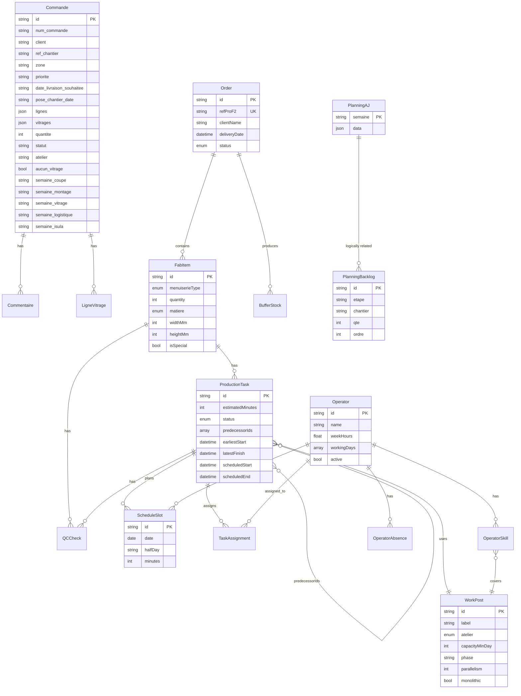

# Migration `sial-planning` → Odoo 18 Enterprise — dossier de handoff

> **Objectif** : donner à une session Claude Code connectée à l'instance
> Odoo 18 Enterprise du groupe VISTA (SIAL / ISULA) toutes les informations
> nécessaires pour reproduire les fonctionnalités de l'app externe
> `sial-planning` en natif Odoo, sans que le développeur doive reposer
> de questions à Marianne.
>
> **Contexte fabricant** : VISTA fabrique des menuiseries alu/PVC sur-mesure
> en Corse. Deux ateliers : **SIAL** (menuiseries) et **ISULA** (vitrages
> isolants CEKAL).
>
> **Chef d'atelier** : Ange-Joseph (AJ) — responsable production & qualité
> (conception, tests, formation, QC, visa qualité final). PAS opératif :
> il ne coupe pas, il ne monte pas. Il pilote.

---

## SECTION 1 — Contexte fonctionnel

### 1.1. Besoin métier initial

Marianne (dirigeante SIAL/ISULA) voulait :

- Sortir le suivi de production **du fichier Excel unique** que passait
  AJ d'ordinateur à ordinateur.
- **Centraliser** commandes, planning atelier, contrôle qualité,
  disponibilité opérateurs, stocks tampons dans un outil unique
  accessible depuis Vercel.
- Pouvoir **anticiper la charge** (chargement 8 semaines à venir), voir
  les **retards**, identifier les **goulots** (Coupe LMT saturé, ISULA
  en attente, etc.).
- Introduire un peu **d'intelligence** (algo de planification, chemin
  critique, "cerveau" apprenant les temps réels vs théoriques).

### 1.2. Problèmes concrets essayés

| Problème | Solution tentée dans l'app |
|---|---|
| Un seul fichier Excel accessible par une seule personne à la fois | App web multi-utilisateurs |
| AJ ressaisissait manuellement les commandes de Marianne | Formulaire `SaisieCommande` structuré |
| Les temps de fabrication étaient dans la tête d'AJ | Nomenclature 28 types × temps unitaires calibrables |
| Impossible de voir "quel op fait quoi cette semaine" | `PlanningAffectations` avec grille poste × jour × opérateur |
| Retards détectés uniquement à J-1 | Widget "retards en cours" dans `Aujourd'hui` |
| Réception des vitrages ISULA non synchro avec SIAL | Modèle `BufferStock`, hooks I7 → V1/V2 |
| Pas de traçabilité des temps réels | Système `Cerveau` : pointage + apprentissage ratio réel/théo |
| Coupe LMT toujours en goulot mais pas de visibilité | `ChargeCapacite` 8 semaines + `detectBottleneck` |
| AJ voulait un truc "comme son Excel" en dernier recours | `PlanningAJ` (dernière tentative) |

### 1.3. Pourquoi Excel n'était pas suffisant à l'origine

- **Un seul utilisateur à la fois** (fichier partagé sur réseau interne).
- **Perte d'historique** (chaque semaine remplace la précédente, pas
  d'archive automatique).
- **Aucune consolidation** : Marianne ne savait pas où en était l'atelier
  sans passer voir AJ.
- Pas de vue "charge à venir" (Excel ne montre que la semaine ouverte).
- Impossible d'exposer aux opérateurs (Excel = laptop AJ).
- Pas de calcul automatique du chemin critique.
- Pas de lien avec les commandes clients (Marianne ressaisissait tout).

### 1.4. Effort déjà consenti sur l'app

- **~15 mois** de développement discontinu (Jan 2025 → Juillet 2026).
- **~20 versions majeures** listées dans les commits git.
- **Environ 60 fichiers TypeScript**, ~15 000 lignes de code.
- **11 phases d'audit et refonte** documentées dans `CHANGELOG.md`.
- **1 solveur Python CP-SAT** développé en Lot 1 (`/solver/`) — jamais mis
  en prod car trop complexe.
- **1 module "cerveau"** d'apprentissage des temps (`src/lib/cerveau.ts`).

### 1.5. Utilisateurs cibles

| Rôle | Nom | Usage attendu | Usage réel |
|---|---|---|---|
| Dirigeante | Marianne | Saisie commandes, suivi global, config | Utilise Carnet + SaisieCommande |
| Chef d'atelier | Ange-Joseph | Planning quotidien + hebdo, QC, RH | **Retourne systématiquement à son Excel** |
| Opérateurs (13) | Julien, Alain, JF, Michel… | Consultation planning, pointage | Utilisation quasi nulle |
| Commercial | Anna-Laura | Consultation charge, dates faisables | Occasionnel |

**Le seul frein identifié bloque tout le projet : AJ n'utilise pas l'app.**

---

## SECTION 2 — Analyse du fichier Excel actuel d'Ange-Joseph

Fichier de référence : `PLAN_PROD_2026.xlsx` (fourni par Marianne).

### 2.1. Structure

**2 feuilles** :

- `Feuil1` (106 lignes × 21 colonnes) — le planning à proprement parler.
- `Feuil2` (7 lignes × 6 colonnes) — table de config très basique
  (`SOUDURE / PRINCIPAL / SEMI-FIXE / DORMANT / TOTAL / LOT PVC` en A,
  `JOURS / LUNDI / MARDI / MERCREDI / JEUDI / VENDREDI` en B-F). Non
  exploitée activement, sert de légende / rappel.

**Format de la feuille 1 — répétition de blocs "semaine"** :

```
Ligne 1 : "Semaine    S25 2026"                          ← header semaine
Ligne 2 : "Jour       Jeudi              Vendredi ..."   ← libellés jours (colspan implicite)
Ligne 3 : "         Etape  Nom  QtéThéo  Réalisé   Etape  Nom  Qté  Réalisé  ..."
Ligne 4 : "         Coupe LMT Paese Novu 128  74  38  ..."
Ligne 5 : "         Renfort   Paese Novu 128  46  46  ..."
...
Ligne N : "" (fin de semaine)
Ligne N+1: "Semaine  S26 2026"                           ← header semaine suivante
...
```

**Colonnes** : chaque jour occupe **4 colonnes** contiguës :
`Étape | Nom du chantier | Qté théorique | Qté réalisée`.

Une semaine = 5 blocs de 4 colonnes = **20 colonnes** (col B à U, la col A
contenant les labels "Semaine"/"Jour"/etc.).

**Contenu par cellule** :
- **Étape** : texte libre parmi ~9 valeurs (Coupe LMT, Coupe LMT/DT,
  Renfort, Soudure, Montage PVC, Montage ALU, Vitrage, ISULA, Emballage).
  Casse et variantes typo hétérogènes (`Vitrage `, `VItrage`,
  `Soudure `, `Montage Alu` vs `Montage ALU`).
- **Nom** : texte libre — nom de chantier connu de tous (`Paese Novu 128`,
  `Cas'Apertura Algajola`, `Casa di Lama`, etc.).
- **Qté théo** : entier (nb de pièces ou d'ouvrants).
- **Qté réalisée** : **entier OU texte libre** (`38`, `0 Fini`,
  `5 (Test OB)`, `17 mais manque paumelles`, `0 Fini Manque SF + Dormants`).

**Aucune formule active, aucune macro, aucun tableau croisé dynamique.**
C'est de la saisie manuelle pure sur une grille figée.

**Aucune mise en forme conditionnelle** (les cellules ne se colorient pas
en rouge en cas de retard).

### 2.2. Ce qu'AJ y met concrètement chaque jour

**Le matin** :
- Ouvre le fichier, va sur la semaine en cours (défilement vertical).
- Regarde les tâches non finies de la veille → décide de les caser
  dans la journée.
- Ajoute les tâches du jour en tapant `Étape / Nom / Qté` sur des
  lignes empilées sous le jour concerné.
- Distribue oralement aux opérateurs.

**En cours de journée** :
- Aucune saisie (l'écran reste chez lui).

**Le soir** :
- Repasse chaque ligne du jour et remplit `Réalisé` :
  - Entier si la tâche est faite en partie/totalité (`38`).
  - `0 Fini` si terminée et pièces expédiées.
  - Texte libre si problème (`Manque paumelles`).
- Reporte les non-finis vers le lendemain en dupliquant la ligne.

**Chaque lundi** :
- Ajoute un nouveau bloc "Semaine SXX 2026" en bas du fichier avec les
  5 sous-blocs jours vides.
- Recopie manuellement les tâches restantes de la semaine précédente.

### 2.3. Consultation

- **PC bureau AJ uniquement** — le fichier est en local.
- **Impression papier occasionnelle** : impression A4 paysage de la
  feuille (rarement, quand il forme un opérateur).
- Pas de mobile, pas de tablette atelier.
- Pas de partage réseau — Marianne demande à AJ verbalement.

### 2.4. Alimentation

**Un seul rédacteur : AJ.** Personne d'autre n'écrit dans ce fichier.

### 2.5. Imports/exports

**Aucun import/export automatique.** AJ retape à la main ce que Marianne
lui donne (souvent bon de commande papier ou email PDF).

**Sources d'entrée mentales de AJ** :
- Commandes clients transmises par Marianne (parfois avec le bon PRO F2
  papier)
- Fichiers CNC générés par PRO F2 pour la coupe
- Bons de livraison fournisseurs (Alu, PVC, accessoires)
- Vitrages CEKAL réceptionnés (traçabilité manuelle sur un cahier)

**Aucune synchro avec Sage, Odoo, ou tout autre système.**

### 2.6. Temps consacré

D'après Marianne : **~30-45 min par jour** sur ce fichier, dont :
- 10 min le matin (planif)
- 5 min éparses en journée (ajustements)
- 15-20 min en fin de journée (saisie réalisé)
- 20-30 min supplémentaires le lundi matin (nouvelle semaine)

---

## SECTION 3 — L'application développée : structure technique

### 3.1. Stack

- **Frontend** : Next.js 14 (App Router), React 18, TypeScript, styles inline (pas de Tailwind actif).
- **Backend** : API Routes Next.js (49 endpoints), Prisma 5.22 ORM.
- **Base de données** : PostgreSQL OVH (host `37.187.250.4`, DB `sial-planning`).
- **Authentification** : NextAuth 4.24 (credentials provider + bcryptjs).
- **Hébergement** : Vercel (front + API serverless).
- **Solveur externe (non déployé)** : Python 3 + OR-Tools CP-SAT + FastAPI dans `/solver/`.
- **Charts** : Recharts 3.8.

### 3.2. Modèle de données Prisma — schéma complet

Vue d'ensemble ci-dessous. Diagramme Mermaid en fin de document (livrable 2).

#### Modèles "opérationnels" (utilisés par l'IHM)

**`Commande`** — source de vérité IHM. JSON `lignes` + `vitrages`.
```
id PK (cuid), num_commande, client, ref_chantier,
zone (default SIAL), priorite (default normale),
semaine_theorique?, semaine_atteignable?,
date_alu?, date_pvc?, date_accessoires?,
date_panneau_porte?, date_volet_roulant?,
date_livraison_souhaitee?,
type (String), quantite (Int), hsTemps (Json?),
lignes (Json?), vitrages (Json?),
aucun_vitrage, aucune_menuiserie,
cmd_alu_passee/pvc_passee/... (booléens),
cmd_alu_necessaire/... (booléens),
avancement (Int), statut (default en_attente),
transporteur?,
etape_coupe_ok/montage_ok/vitrage_ok/palette_ok (booléens),
etape_coupe_date/montage_date/vitrage_date/palette_date (String YYYY-MM-DD),
notes?, type_commande?, atelier (default SIAL), montant_ht?,
acompte_recu, acompte_montant?, acompte_date?,
reliquat_alu/pvc/accessoires + desc + date,
nb_livraisons (Int), dates_livraisons (Json?),
semaine_coupe?, semaine_montage?, semaine_vitrage?,
semaine_logistique?, semaine_isula?,
-- Phase 0-A (audit) :
pose_chantier_date?, regroupement_camion (bool),
chantier_split_autorise (bool), controle_qualite_specifique?,
notes_pose?, risque_perso (default "bas"),
createdAt, updatedAt
```

**Le champ `lignes` (Json) contient des objets** :
```
{
  type, quantite, coloris,
  largeur_mm, hauteur_mm,
  coloris_lot,
  laquage_externe (bool), delai_laquage_jours,
  ferrage_special, temps_supp_min,
  operateur_prefere, operateur_interdit,
  tampon_apres_min,
  hs_nb_profils, hs_t_coupe, hs_t_montage, hs_t_vitrage,
  hs_op_montage, hs_op_vitrage, hs_notes
}
```

**Le champ `vitrages` (Json)** :
```
{
  composition, quantite, surface_m2, fournisseur,
  cmd_passee, date_reception, position,
  face_exterieure, face_interieure,
  couleur_intercalaire, epaisseur_intercalaire,
  largeur, hauteur, forme,
  prix_m2, prix_total,
  largeur_origine, hauteur_origine, surface_m2_origine,
  vitrage_id_ext, ligne_menuiserie_id
}
```

**`LigneVitrage`** (auxiliaire — utilisé pour import CSV)
```
id, commandeId, num_commande, client, ref_chantier,
composition, quantite (default 1), position,
largeur_mm?, hauteur_mm?, epaisseur_intercalaire?,
coloris_intercalaire?, largeur_we?, hauteur_we?, perimetre_we?,
date_fabrication?, createdAt, updatedAt
```

**`Operator`** (13 opérateurs en base)
```
id (cuid), name, weekHours (Float), posts (String[]),
workingDays (Int[]) default [0..4],
notes?, active (default true),
defaultSchedule (Json?), naissance?
```

**`OperatorSkill`** (compétences × niveau)
```
id, operatorId FK, workPostId FK?, menuiserieType?,
level (Int, 0=aucun, 1=apprenti, 2=autonome, 3=expert),
UNIQUE (operatorId, workPostId, menuiserieType)
```

**`OperatorAbsence`**
```
id, operatorId FK, date (DateTime), reason?
```

**`WorkPost`** (35 postes)
```
id (String PK: "C3", "F2", "I7", "U1", ...),
label, shortLabel?,
atelier (enum SIAL|ISULA),
capacityMinDay (Int),
phase? (coupe/montage/vitrage/isula/logistique/autre),
maxOperators?, tamponMinAfter?, color?,
visible (bool), sortOrder (Int),
parallelism? (default 1), parallelGain (Json?),
monolithic (bool default false),
defaultOperators (String[])
```

**`PlanningRH`** (heures/absences hebdo)
```
semaine (PK, ex "2026-W25"), plan (Json), valide (bool), updatedAt
```

**`PlanningPoste`** (affectations poste×jour×demi)
```
semaine (PK), plan (Json), updatedAt
```

**`PlanningIsula`** (vitrage isolant hebdo)
```
semaine (PK), plan (Json), valide (bool), updatedAt
```

**`PlanningAJ`** (grille Excel-like AJ, Phase Planning AJ)
```
semaine (PK, ex "S25 2026"), data (Json), updatedAt
```

**`PlanningBacklog`** (tâches à positionner façon backlog)
```
id, etape, chantier, qte?, note?, ordre (Int),
createdAt, updatedAt
INDEX (ordre)
```

#### Modèles "industriel" (nouveau schéma, phase 0-C, majoritairement inutilisé)

**`Order`** ← projection depuis `Commande`
```
id, refProF2 UNIQUE (ex "CMD-<commandeId>"),
refChantier, clientName, deliveryDate,
status (enum A_LANCER, EN_COURS, ATTENTE_VITRAGE, ATTENTE_IGU,
        PRET_LIVRAISON, LIVRE, SUSPENDU),
notes?, createdAt, updatedAt
```

**`FabItem`** ← une ligne d'`Order` (une menuiserie)
```
id, orderId FK,
menuiserieType (enum de 27 valeurs : OB1_PVC, OB2_PVC, C3V3R, ...),
quantity, label, isSpecial (bool),
specialType (enum), matiere (enum ALU/PVC/ALU_PVC),
widthMm?, heightMm?
```

**`ProductionTask`** ← étape de fab d'un `FabItem`
```
id, fabItemId FK, workPostId FK, label,
estimatedMinutes, actualMinutes?, status (enum),
scheduledDate?, startedAt?, completedAt?, blockedReason?,
sortOrder, isBlocking,
-- Phase 0-B :
predecessorIds (String[]) — DAG des précédences,
earliestStart? — borne basse jalons matière/laquage,
latestFinish? — calculé par backward,
scheduledStart?, scheduledEnd?
```

**`ScheduleSlot`** ← créneau ½ journée × opérateur (Phase 0-B)
```
id, taskId FK, operatorId FK, date, halfDay (String "AM"|"PM"),
minutes, createdAt
UNIQUE (taskId, operatorId, date, halfDay)
```

**`BufferStock`** ← stocks tampons inter-postes
```
id, orderId?, type (enum BufferType),
quantity, unit, updatedAt,
-- Phase 1-B :
taskProducerId? (I7 qui a produit),
taskConsumerId? (V1/V2 qui consomme),
fabItemSourceId?, readyAt?, consumedAt?
```

**`QCCheck`** ← contrôles qualité
```
id, fabItemId FK, taskId?, qcRef, label,
result (enum OK/NOK/REPRISE/REBUT), value?,
checkedAt?, checkedBy?, actionTaken?
```

**`NonConformity`** ← non-conformités
```
id, fabItemId, qcRef?, description,
severity (enum MINOR/MAJOR/BLOCKING),
status (enum DETECTED/IN_QUARANTINE/UNDER_REPAIR/RESOLVED/SCRAPPED),
cause?, action?, resolvedAt?, createdAt
```

**`TaskAssignment`** ← lien op × task
```
id, taskId FK, operatorId FK
```

#### Modèles annexes

**`Tache`** — bibliothèque de temps unitaires (paramétrable UI admin)
```
id, nom, temps_unitaire (Float), unite (min|h|jour),
categorie (default production), parallelisable,
competences (Json), ordre, actif
```

**`AvancementJournalier`** — pointage jour
```
id, date (String), operateur, tacheId, commandeId?,
quantite, notes?, createdAt
```

**`Backup`** — snapshots BDD
```
id, data (Json), createdAt
```

**`ControleQualite`** — daily QC (SQDCP)
```
date PK (String), data (Json), updatedAt
```

**`StockTampon`** — stocks tampons simples
```
id PK, actuel (Float), updatedAt
```

**`DayConfig`** — mode jour (FRAPPES/COULISSANTS/…)
```
date PK, mode (default FRAPPES), updatedAt
```

**`MemoAction`** — mémos Andon / IA
```
id, auteur, texte, type (memo|tache|rappel|planning),
priorite (normale|urgente|critique),
statut (ouvert|en_cours|fait|annule),
echeance?, createdAt, updatedAt
```

**`User`**
```
id, email UNIQUE, password (bcrypt), nom,
role (default OPERATEUR), createdAt
```

Autres tables auxiliaires : `SemaineValidee`, `TacheRituelle`,
`MembreEquipe`, `CompetenceOperateur`, `Commentaire`.

### 3.3. Endpoints API — 49 routes

Regroupées par domaine :

**Commandes** :
- `GET/POST /api/commandes` — liste + création
- `GET/PATCH/DELETE /api/commandes/[id]` — CRUD

**Planning classique** :
- `GET/PUT /api/planning/affectations` — affectations poste×jour×demi
- `POST /api/planning/batch-weeks` — sauvegarde en masse
- `POST /api/planning/clean-feries` — purge jours fériés
- `GET/PUT /api/planning/mode-jour` — mode FRAPPES/COULISSANTS
- `GET/PUT /api/planning-rh` — heures/absences
- `GET/PUT /api/planning-poste` — planning par poste
- `GET/PUT /api/planning-isula` — planning atelier ISULA

**Planning AJ (Excel-like)** :
- `GET/PUT /api/planning-aj` — grille par semaine
- `POST /api/planning-aj/copy` — copie semaine
- `GET/POST /api/planning-aj/backlog` — backlog global
- `PATCH/DELETE /api/planning-aj/backlog/[id]`

**Solveur** :
- `POST /api/scheduling/backward` — algo backward CP-like en JS

**Ressources** :
- `GET/POST /api/operators`, `GET/PATCH /api/operators/[id]`
- `GET /api/posts`
- `GET/POST/PUT /api/taches`, `PATCH/DELETE /api/taches/[id]`, `POST /api/taches/reset`

**Suivi opérationnel** :
- `GET/POST /api/pointage-jour`
- `GET/POST/PATCH /api/avancement`
- `PATCH /api/production-tasks/[id]` — statuts task
- `GET /api/retards` — reporting retards
- `GET /api/controle-qualite` — SQDCP

**Stocks/logistique** :
- `GET/POST /api/stocks`, `GET/PATCH /api/lignes-vitrage`
- `POST/DELETE /api/chargements-frozen`
- `GET /api/semaines-fab`

**Cerveau IA** :
- `GET /api/cerveau` — dashboard
- `POST /api/cerveau/learn` / `/record` — enregistrement
- `GET /api/cerveau/learned-times` — ratios appris

**Assistant IA** :
- `POST /api/assistant` — Anthropic API
- `POST /api/chat` — chat conversationnel
- `GET/POST/PATCH /api/memos` — mémos assistant

**Import/sync** :
- `POST /api/import-csv`
- `GET /api/sync/status`, `POST /api/sync/{import,export}`
- `GET /api/analyse` — analyse texte assisté

**Admin** :
- `GET/POST/PATCH /api/admin/users`
- `POST /api/admin/resync-all` — reprojection Commande → Order

**Auth** :
- `[...nextauth]` NextAuth

**Stats** :
- `/api/stats/{postes,nc,speciaux,flux-inter-ateliers}`

**Backup** :
- `GET/POST /api/backup`

**Divers** :
- `GET /api/referentiel` — nomenclature exportée
- `GET /api/memos`

### 3.4. Authentification / gestion utilisateurs

- NextAuth v4 avec provider **credentials** (email + mot de passe bcrypt).
- Rôles : `ADMIN` / `OPERATEUR` (champ `User.role`).
- Permissions granulaires via champ JSON `permissions` sur `User`
  (tabs autorisés, droits d'écriture).
- Cookies session Next.js standard.
- Pas de SSO, pas d'OAuth.

### 3.5. Hébergement

- **Front + API** : Vercel (auto-deploy sur push `main`).
- **BDD** : PostgreSQL OVH (host `37.187.250.4:5432`, pgbouncer sur 6432).
- **Solveur Python** : jamais déployé — dispo dans `/solver/` mais tourne
  uniquement en local si l'user le lance.
- **Domaine** : sial-planning.vercel.app (probablement + un domaine custom).

---

## SECTION 4 — Écrans & fonctionnalités

### 4.1. Cartographie des écrans

Navigation à 2 niveaux : **7 groupes thématiques** × sous-onglets.

| Groupe | Onglet | Composant | Route |
|---|---|---|---|
| 🌅 Aujourd'hui | Aujourd'hui | `Aujourdhui.tsx` | `#aujourdhui` |
| 📅 Planning | Planning AJ (rapide) | `PlanningAJ.tsx` | `#planning_aj` |
| | Hebdo (commandes) | `PlanningCommandes.tsx` | `#planning_fab` |
| | Hebdo (affectations) | `PlanningAffectations.tsx` | `#planning_fab` |
| | Charge 8 sem. | `ChargeCapacite.tsx` | `#charge` |
| | Suivi & crise | `Dashboard.tsx` + `PlanningCrise.tsx` | `#dashboard` |
| 📂 Commandes | Carnet | `Carnet.tsx` | `#carnet` |
| | ➕ Nouvelle | `SaisieCommande.tsx` | `#saisie` |
| 🚚 Logistique | Livraisons | `PlanningLivraison.tsx` | `#livraison` |
| | Chargements | `PlanningChargements.tsx` | `#chargements` |
| | Chauffeurs | `Chauffeurs.tsx` | `#chauffeurs` |
| 👥 Équipe | Planning RH | `PlanningRH.tsx` | `#rh` |
| | Compétences | `GestionCompetences.tsx` | `#rh` |
| | Pointage | `PointageJour.tsx` | `#pointage` |
| 🔧 Atelier | Affichage atelier | `AffichageAtelier.tsx` | `#affichage_atelier` |
| | ISULA planning | `PlanningIsula.tsx` | `#isula` |
| | ISULA besoins | `BesoinVitrages.tsx` | `#isula` |
| | Qualité (SQDCP) | `Qualite.tsx` | `#qualite` |
| | Stocks tampons | `StocksTampons.tsx` | `#stocks` |
| 📊 Suivi/IA | Statistiques admin | `StatsAdmin.tsx` | `#stats` |
| | Cerveau (learned) | `CerveauDashboard.tsx` | `#cerveau` |
| | Assistant IA | `AssistantIA.tsx` (composant flottant) | — |
| ⚙ Config | Nomenclature | `Nomenclature.tsx` | `#nomenclature` |
| | Simulateur (chemin critique) | `Simulateur.tsx` | `#simulateur` |
| | Import CSV | `ImportCSV.tsx` | `#import` |
| | Admin utilisateurs | `AdminUsers.tsx` | `#admin` |
| | Temps unitaires | `/admin/temps-unitaires/page.tsx` | route dédiée |

**Total : ~25 écrans (onglets) + 4 composants flottants** (Assistant IA,
TutoAJ, Andon panel, SQDCP panel).

### 4.2. Détail par écran principal

Je me concentre sur les écrans que AJ était censé utiliser.

#### `Aujourdhui.tsx` (~800 lignes)

**Objectif** : tableau de bord du jour pour AJ.

**Composants principaux** :
- Widget "retards en cours" (rouge en haut si retards)
- Météo du jour + heure
- Sélecteur date (avec swipe mobile)
- Total opérateur présent
- Encart Critical Ratio + Bottleneck + Takt time
- Suggestion Heijunka du jour (mode Frappes/Coulissants)
- Liste des tâches du jour groupées par poste
- Panneau Andon (signalement panne)
- Panneau SQDCP (Sécurité/Qualité/Délai/Coût/Personnel)
- Bouton "imprimer feuille du jour"

**Actions** :
- Cocher une tâche comme faite (étape_X_ok)
- Marquer un op absent (bascule PlanningRH)
- Créer un mémo assistant IA
- Signaler un problème Andon

#### `PlanningAJ.tsx` (~700 lignes) — le plus récent, dernière tentative

**Objectif** : reproduire exactement le fichier Excel d'AJ.

- Multi-semaines empilées (1-5 sélectionnables)
- Grille par semaine : 5 jours × N lignes × 4 sous-colonnes
  (Étape / Nom / Qté théo / Qté réal)
- Panneau backlog gauche : tâches à positionner, filtrable par étape
- Drag & drop : backlog → cellule, cellule → cellule
- Mini-formulaire inline "+ Ajouter tâche" au backlog
- Édition inline dans les cellules
- Bouton "Copier depuis sem. précédente"
- Sauvegarde debounced 500ms par semaine

#### `PlanningAffectations.tsx` (~3800 lignes) — LE PLUS COMPLEXE

**Objectif** : grille poste × jour × demi-journée × opérateur.

- Grille : lignes = 35 postes (groupés par phase), colonnes = 10 demi-journées
- Chaque cellule : ops affectés + chantiers + extras (formations, absences)
- Drag & drop opérateur vers cellule
- Drag & drop chantier
- Timeline horizontale par heure (drag temporel)
- Bouton "Proposition auto (semaines)" — algo glouton V2
- Bouton "Planifier backward (créneaux)" — appelle solveur
- Modal `AutoAssignReport` : rapport avec chantiers placés/partiels/non placés + taux d'utilisation ops
- Verrouillage semaine (lock)
- Masquage tâches (hiddenTasks)
- Export/impression fiches
- Écran extrêmement dense — c'est le point de friction majeur AJ

#### `SaisieCommande.tsx` (~1000 lignes)

**Objectif** : formulaire de saisie d'une commande client.

- Import PRO F2 par copier-coller texte (parser regex)
- 5 blocs : Identification / Planning livraison / Pose & transport /
  Menuiseries (multi-lignes) / Vitrages isolants (multi-lignes) /
  Achats matières / Acompte / Reliquats / Multi-livraisons /
  Qualité & risque
- Auto-calcul du chemin critique en temps réel
- Options avancées par ligne (hauteur_mm, coloris_lot, laquage,
  ferrage_special, op_prefere/interdit, tampon)
- Multi-livraisons (jusqu'à 5 dates)

#### `Carnet.tsx` (~1500 lignes)

**Objectif** : liste toutes les commandes avec filtres.

- Filtres persistés (statut, priorité, chantier, dates…)
- Vue table dense
- Actions inline : Éditer / Dupliquer / Supprimer / Passer statut
- Export CSV

#### `ChargeCapacite.tsx` (~500 lignes)

**Objectif** : vue heatmap 8 semaines.

- Table 8 sem × 35 postes avec % de saturation coloré
- Widget OEE par poste
- Détection goulot semaine par semaine

### 4.3. Workflow utilisateur type

**Un lundi matin, AJ est censé faire** :

1. Ouvrir l'app → onglet `Aujourd'hui` → vérifier retards
2. Aller sur `PlanningAffectations` → cliquer "Proposition auto"
3. Ajuster manuellement les affectations (drag&drop ops)
4. Verrouiller la semaine
5. Imprimer les fiches opérateur
6. En cours de journée : cocher les tâches faites dans `PointageJour`
7. Le soir : saisir avancement, mettre à jour statuts

**Ce qu'AJ fait en réalité** :
1. Ouvrir Excel local `PLAN_PROD_2026.xlsx`
2. Ajouter les lignes du jour
3. Ne jamais ouvrir l'app

### 4.4. Boutons/actions/wizards spécifiques

- **Import PRO F2** : copier-coller de texte brut depuis PRO F2, parser regex extrait les vitrages
- **Proposition auto (semaines)** : algo glouton chantier-par-chantier
- **Planifier backward (créneaux)** : algo backward depuis deadline
- **Copier semaine précédente** : `PlanningAJ`
- **Génération fiches PDF** : impression par opérateur (print CSS)
- **Cerveau > Learn** : POST des temps réels vs théo
- **Assistant IA** : chat + dictée pour créer mémos/tâches
- **Resync all** : POST admin pour reprojeter toutes les Commandes vers Order
- **Import CSV** : upload CSV multi-onglets
- **Backup manuel** : snapshot BDD

### 4.5. Notifications / emails / activités

- **Aucun email** envoyé.
- **Aucune notification push**.
- **Memos assistant IA** : stockés en BDD, visibles dans Aujourd'hui + Andon panel.
- **Widget retards** : encart rouge visuel uniquement.

---

## SECTION 5 — Diagnostic : pourquoi ça n'a pas fonctionné

### 5.1. Retours utilisateur explicites d'Ange-Joseph

Directement rapportés par Marianne (verbatim) :

- « L'auto-planning ne fait pas ce que je veux. C'est nul. »
- « Trop compliqué à utiliser. »
- « Je ne comprends pas ce que je vois. »
- « C'est plus lent que mon Excel. »
- « Je ne trouve pas les infos que je veux. »

### 5.2. Points de friction observés

Basé sur l'analyse du code et l'historique de commits :

- **`PlanningAffectations.tsx` fait 3800 lignes** — un seul écran qui tente
  de tout faire (grille poste×jour×demi + drag opérateur + drag chantier +
  timeline heures + livraisons + verrouillage + rapport auto-assign
  modale + impression).
- **35 postes de travail visibles** dont beaucoup masqués par défaut mais
  toujours dans la nomenclature → cognitively overwhelming.
- **Demi-journées (10 par semaine) × 35 postes = grille de 350 cellules**
  potentielles. Impossible à naviguer avec les yeux.
- **Aucun contexte visuel** : les cellules affichent des ID poste (`C3`,
  `F2`, `MHS`, `V1`) que seul AJ traduit mentalement.
- **11 phases de refonte** en 15 mois : signe que le produit n'a jamais
  trouvé son adéquation utilisateur.
- **Solveur CP-SAT jamais utilisé** parce que trop de setup requis
  (Python virtualenv sur le serveur).
- **Rapport AutoAssignReport** affiche des raisons techniques
  (`"aucun opérateur compétent sur F2"`, `"partiel (3/5 créneaux)"`)
  au lieu de suggestions actionnables.

### 5.3. Fonctionnalités manquantes vs Excel

| Fonctionnalité Excel | Statut dans l'app |
|---|:---:|
| Cellules sans structure imposée (texte libre partout) | ❌ Formulaires structurés |
| Copier-coller multi-cellules | ❌ Non |
| Ctrl+Z (undo) | ❌ Non |
| Ctrl+F recherche globale | ❌ Non |
| Filtres 1-clic par colonne | ⚠️ Partiel (`Carnet.tsx`) |
| Impression 1-clic feuille du jour | ⚠️ Partiel (bouton mais mise en page CSS approximative) |
| Format libre "Réalisé" ("0 Fini", "Manque paumelles") | ✅ Depuis `PlanningAJ` |
| Voir 3-4 semaines à l'écran d'un coup | ✅ Depuis `PlanningAJ` (récent) |
| Réorganiser par tri (colonne) | ❌ Non dans les grilles |
| Ajouter une colonne temporaire | ❌ Structure figée |

### 5.4. Problèmes techniques observés

- Build Vercel a cassé plusieurs fois pour des erreurs ESLint (apostrophes,
  unused vars). Corrigé.
- BDD Prisma pas synchronisée avec le code — table `_prisma_migrations`
  n'existait pas → intervention manuelle SQL.
- pgBouncer sur port 6432 poque pour les migrations Prisma (`prepared
  statement already exists`) — a nécessité contournement par psql direct.
- Écrans très longs (`PlanningAffectations.tsx`) lents à charger sur mobile.

### 5.5. Formation

- **Aucune formation formelle** dispensée à AJ.
- Marianne lui a montré 2-3 fois, il n'a pas insisté.
- Composant `TutoAJ.tsx` existe (tuto in-app) mais peu de trace d'usage.

### 5.6. Usage partiel d'AJ

À notre connaissance : **usage quasi-nul** au quotidien. Il n'ouvre l'app
que si Marianne le lui demande explicitement pour vérifier un détail.
Il ne saisit **jamais** d'avancement ou de statut lui-même.

---

## SECTION 6 — Ce que Excel fait mieux que l'app

### 6.1. Fonctionnalités Excel utilisées et absentes de l'app

- **Grille infinie** : AJ ajoute une ligne, une colonne, quand il veut.
- **Aucune validation** sur les cellules → il tape ce qu'il veut.
- **Historique des semaines** : les semaines précédentes restent visibles
  en dessous, il scroll pour comparer.
- **Impression WYSIWYG** par sélection.
- **Aucune connexion réseau requise** : il travaille même quand le wifi
  atelier est coupé.

### 6.2. Habitudes de travail

- **Ctrl+C / Ctrl+V** pour dupliquer une ligne de la veille vers le jour suivant.
- **Ctrl+D** pour recopier vers le bas.
- **F4** pour figer des cellules dans une formule (rare).
- **Format libre "Réalisé"** avec commentaires en cellule.

### 6.3. Interactions rapides

- **Un seul clic + tabulation** entre cellules (au lieu de 2-3 clics
  dans l'app pour ouvrir une modal).
- **Zoom à la molette** pour voir plus/moins.
- **Fenêtres multiples** (ouvrir 2 semaines côte à côte).

### 6.4. Impression / partage

- **Impression paysage A4** par sélection (uniquement les semaines à
  imprimer).
- **Envoi email** en pièce jointe .xlsx à Marianne quand elle demande.
- Aucun besoin de générer un PDF ou un lien.

---

## SECTION 7 — Contraintes et exigences pour la version Odoo

### 7.1. Poste de travail d'Ange-Joseph

- **PC bureau** dans son bureau atelier (Windows).
- Pas de tablette, pas de mobile.
- Pas de borne atelier partagée (les opérateurs consultent le papier).

### 7.2. Connectivité

- **Wifi atelier** parfois instable.
- **Offline occasionnel nécessaire** pour ne pas bloquer AJ quand ça coupe.
- Odoo Enterprise ne fonctionne pas offline nativement → considérer une
  vue Kanban avec cache localStorage minimal.

### 7.3. Impression

- **Imprimante bureau** — A4 paysage privilégié.
- **Format demandé** :
  - 1 feuille = 1 semaine (5 jours × N lignes)
  - Police 9-10pt (pour tenir sur A4)
  - Titre en haut : "Semaine SXX 2026 — Atelier SIAL"

### 7.4. Simplicité maximale

- **Un seul écran** pour la planification hebdo (pas de sous-onglets).
- **Édition inline** — pas de modal.
- **Drag & drop** natif Odoo (Gantt/Kanban).
- **Peu de champs obligatoires** — AJ tape ce qu'il veut.
- **Aucun wizard** — jamais.

### 7.5. Intégration avec l'Odoo existant

Informations à confirmer par le développeur Odoo :

- Version : **Odoo 18 Enterprise** (à vérifier via `ir.module.module`).
- Instance : `https://erp.groupe-vista.fr`, DB `VISTA-PRODUCTION`.
- Modules probablement installés :
  - `sale`, `sale_management` — devis/commandes clients
  - `mrp`, `mrp_workorder`, `mrp_plm` — fabrication
  - `stock`, `purchase` — inventaire, achats
  - `quality`, `quality_control` — contrôle qualité
  - `planning` — module Planning Enterprise (à confirmer)
  - `hr`, `hr_attendance`, `hr_holidays` — RH
  - `project` — gestion projet
- **À demander à Marianne** :
  - Les commandes clients sont-elles saisies dans Odoo (`sale.order`) ?
  - Les ordres de fab sont-ils créés dans Odoo (`mrp.production`) ?
  - Y a-t-il un lien SO → MRP automatique ?
  - Les BOM (nomenclatures) existent-elles dans `mrp.bom` ?
  - Les opérateurs sont-ils dans `hr.employee` ?
  - Marianne saisit-elle 100 % dans Odoo ou une partie ailleurs (PRO F2) ?

### 7.6. Rôles utilisateur

| Personne | Rôle Odoo suggéré | Actions |
|---|---|---|
| Marianne | Manager production | Saisit commandes (`sale.order`), lance MRP, admin |
| Ange-Joseph | Chef d'atelier | Planifie MRP, valide QC, distribue OF |
| Anna-Laura | Commercial | Consulte charge, dates faisables client |
| Opérateurs (13) | Manufacturing users | Consulte OF, saisit avancement (mobile MRP) |

### 7.7. Volumétrie estimée

- **OF simultanés** : ~30-50 chantiers actifs à un instant T.
- **Types menuiseries** : 28 types nomenclaturés (27 dans l'enum
  `MenuiserieType` + hors_standard).
- **Opérateurs** : 13 dans SIAL+ISULA, ~10 actifs à un moment donné.
- **Postes de travail** : 35 dans `WorkPost`, ~20 visibles/utilisés.
- **Semaines actives** : 8 semaines à l'écran (charge future) +
  1-2 semaines terminées à archiver.
- **Vitrages/semaine** : 100-300 unités.
- **Commandes/mois** : ~40-60.

---

## LIVRABLES

### Livrable 2 — Diagramme du modèle de données (Mermaid)



### Livrable 3 — User stories d'Ange-Joseph

Format : *"En tant qu'AJ, je veux [action] pour [bénéfice], parce que dans
Excel je fais [comment]"*.

1. **En tant qu'AJ, je veux voir 3-4 semaines empilées sur un seul écran**
   pour anticiper les enchaînements de chantiers, parce que dans Excel je
   scrolle verticalement et je peux comparer les semaines côte à côte.

2. **En tant qu'AJ, je veux poser un chantier sur un jour × une étape en
   1 clic + saisie** (ou drag&drop d'un backlog), pour éviter les 3 clics
   qu'un formulaire modal exige, parce que dans Excel je clique dans une
   cellule et je tape.

3. **En tant qu'AJ, je veux écrire dans la case "Réalisé" du texte libre**
   ("0 Fini", "Manque paumelles", "17 mais manque SF + Dormants"), pour
   ne pas être bloqué par une validation Integer, parce que dans Excel
   la cellule accepte n'importe quoi.

4. **En tant qu'AJ, je veux copier la semaine précédente vers la nouvelle
   en 1 clic** (avec effacement des "Réalisé"), pour ne pas retaper les
   chantiers récurrents, parce que dans Excel je fais copier-coller de
   bloc.

5. **En tant qu'AJ, je veux ajouter une étape "custom" quand un chantier
   sort de la nomenclature standard** (ex : "Test étanchéité"), pour ne
   pas être coincé, parce que dans Excel je tape le nom de l'étape.

6. **En tant qu'AJ, je veux imprimer la feuille du jour ou de la semaine
   en 1 clic** (A4 paysage), pour la donner aux opérateurs en début de
   journée, parce que dans Excel Ctrl+P suffit.

7. **En tant qu'AJ, je veux voir la liste des chantiers "à positionner"
   à gauche** (backlog), pour glisser-déposer vers un jour × étape,
   parce que dans Excel j'ai une feuille "à faire" que je consulte.

8. **En tant qu'AJ, je veux qu'un chantier soit identifié par son NOM**
   (ex : "Paese Novu 128"), pas par un ID technique de commande client,
   parce que dans Excel je tape le nom que je connais.

9. **En tant qu'AJ, je veux que les cellules soient colorées par
   chantier automatiquement** (même couleur pour toutes les lignes du
   même chantier), pour repérer visuellement le suivi, parce que dans
   Excel je surligne manuellement les couleurs de mes chantiers importants.

10. **En tant qu'AJ, je veux que la cellule "Réalisé" devienne rouge si
    différente de "Qté théo"**, pour repérer les retards de production,
    parce que dans Excel je mets des couleurs à la main.

11. **En tant qu'AJ, je NE VEUX PAS que le système choisisse automatiquement
    à ma place** où placer les chantiers, parce que je connais des
    contraintes que le système ignore (peintre malade, machine à réparer,
    priorité client urgente…).

12. **En tant qu'AJ, je veux que le système garde mes modifications
    même quand je change de semaine et reviens dessus** (sauvegarde auto),
    parce que dans Excel il ne me demande pas de sauvegarder à chaque fois.

### Livrable 4 — Tableau de correspondance app → Odoo

| App existante | Odoo natif | Module custom nécessaire ? |
|---|---|---|
| Écran **PlanningAJ** (grille Excel-like) | `planning.slot` (Enterprise) en vue Gantt groupée par `etape` | Champs additionnels : `etape`, `qte_theo`, `qte_reel` (Char pour "0 Fini"). Vue custom XML. |
| **PlanningBacklog** (tâches à positionner) | `planning.slot` sans `start_datetime` | Vue Kanban filtrée. |
| Table **Commande** (JSON `lignes` + `vitrages`) | `sale.order` + `sale.order.line` | Champs custom `x_chantier_name`, `x_ref_pro_f2`, `x_pose_chantier_date`, `x_regroupement_camion`. |
| **FabItem** (une menuiserie à fabriquer) | `mrp.production` | Champ custom `x_menuiserie_type` (Selection des 27 types). |
| **ProductionTask** (étape de fab) | `mrp.workorder` | Champs `x_predecessor_ids`, `x_earliest_start`. |
| **ScheduleSlot** (créneau ½j × op) | `planning.slot` OU `mrp.workorder.time_ids` | Choisir un des deux, pas les deux. |
| **WorkPost** (35 postes) | `mrp.workcenter` | Mapping 1:1, ajouter `x_atelier` (SIAL/ISULA), `x_phase`, `x_monolithic`, `x_parallelism`. |
| **Operator** (13 opérateurs) | `hr.employee` | Ajouter `x_week_hours`, `x_working_days`. Absences → `hr.leave`. |
| **OperatorSkill** (compétences × niveau) | `hr.employee.skill` (Enterprise skills) OU `mrp.workcenter.member_ids` | Utiliser skills natif. |
| **PlanningRH** (heures/absences hebdo) | `hr.attendance` + `hr.leave` | Aucune. |
| **BufferStock** (stocks tampons ISULA→SIAL) | `stock.quant` sur emplacements dédiés | Créer des `stock.location` "Buffer T-S1", "Buffer VITRAGES_ISULA". |
| **QCCheck** (contrôles qualité) | `quality.check` | Configurer `quality.point` par workorder. |
| **NonConformity** | `quality.alert` | Aucune. |
| Écran **SaisieCommande** | Formulaire `sale.order` natif | Ajouter les champs custom listés ci-dessus dans la vue XML. |
| Écran **Carnet** (liste commandes) | Vue List `sale.order` | Aucune, filtrer par tag/étape. |
| Écran **ChargeCapacite** (heatmap 8 sem) | Rapport `mrp.workcenter.productivity` OU `spreadsheet` | Rapport BI custom recommandé. |
| Écran **Aujourdhui** (dashboard AJ) | Dashboard OWL custom | Vue "My Dashboard" avec widgets Kanban + Gantt du jour. |
| Écran **Cerveau** (learned times) | Rapports Analytics natifs + `mrp.workcenter.productivity` | Peut être remplacé par les rapports d'atelier natifs. |
| Route **/api/retards** | Filtre `mrp.production` où `date_finished > commitment_date` | Aucune, vue List filtrée. |
| **AssistantIA** | ChatGPT / Claude via HTTP request depuis Odoo | Considérer omission (peu utilisé). |

### Livrable 5 — Points de vigilance UX (à ne PAS reproduire)

1. **Ne pas mettre 20+ onglets** au même niveau. Odoo a déjà son menu →
   AJ trouve tout dans "Manufacturing" ou "Planning".

2. **Ne pas exiger de remplir tous les champs** d'un OF. Le formulaire
   `mrp.production` par défaut est trop long → cacher les champs
   inutiles à AJ (fields visibility par user group).

3. **Ne pas afficher les IDs techniques** (`C3`, `F2`, `MHS`). Utiliser
   les labels lisibles ("Coupe LMT", "Ferrage frappes"). Le champ
   `mrp.workcenter.name` doit être humain.

4. **Ne pas forcer de wizard** — jamais. AJ déteste les modales
   séquentielles.

5. **Ne pas cacher le drag&drop** derrière un menu. La vue Gantt
   Enterprise doit être le mode par défaut.

6. **Ne pas empêcher le texte libre** dans "Réalisé". Le champ doit être
   `Char` (String), pas `Integer`. Si Odoo natif force Integer, faire
   un champ custom `x_qte_reel_texte` en Char.

7. **Ne pas segmenter le planning** en 10 vues différentes. Une seule
   vue Gantt à 3-4 semaines par défaut.

8. **Ne pas exiger la connexion réseau** pour les actions courantes.
   Cacher les données de la semaine en localStorage dans le browser
   (via `web_service_cache` custom).

9. **Ne pas exiger un lien à un `sale.order`** pour créer un slot AJ.
   Le champ chantier doit être **Char libre** avec autocomplete
   optionnelle vers les `sale.order` existants.

10. **Ne pas afficher les timestamps précis** (ex : "2026-06-08 14:32:15").
    Utiliser les libellés semaine ("S25 2026") et demi-journée ("Lun AM").

11. **Ne pas envoyer d'emails automatiques**. AJ ne veut pas être
    interrompu.

12. **Ne pas exiger de MDP fort ou 2FA** — AJ va gueuler.

13. **Ne pas mettre de rapport auto-généré** qui prend > 3 secondes à
    s'afficher.

14. **Ne pas retirer la possibilité d'imprimer**. Bouton "Print"
    toujours visible et fonctionnel.

### Livrable 6 — Recommandations d'architecture Odoo

#### Modules natifs à utiliser

| Module | Usage |
|---|---|
| `sale`, `sale_management` | Commandes clients — Marianne les saisit. |
| `mrp` | Ordres de fabrication (un OF par menuiserie ou par groupe). |
| `mrp_workorder` | Étapes de fab au sein d'un OF (Coupe, Renfort, Soudure…). |
| `mrp_plm` (si dispo) | Nomenclatures avec versions. |
| `planning` (Enterprise) | **Vue Gantt Enterprise avec drag&drop** — CE MODULE EST LE CŒUR. |
| `quality`, `quality_control` | Contrôles QC par workorder. |
| `stock` | Réceptions matières, buffer stocks. |
| `purchase` | Achats fournisseurs (Alu, PVC, accessoires). |
| `hr`, `hr_holidays`, `hr_attendance` | Opérateurs, absences, heures. |
| `hr_skills` (Enterprise) | Compétences × niveaux par opérateur. |

#### Modules custom à écrire

**`sial_atelier_planning`** — cœur du projet

- Étend `planning.slot` avec :
  - `etape` (Selection : Coupe LMT / Coupe LMT/DT / Renfort / Soudure /
    Montage PVC / Montage ALU / Vitrage / ISULA / Emballage — extensible)
  - `chantier_name` (Char, indexed) — nom du chantier
  - `chantier_ref_id` (Many2one → `sale.order` ou `mrp.production` —
    optionnel, autocomplete)
  - `qte_theo` (Integer)
  - `qte_reel` (Char — pour accepter "0 Fini", "Manque paumelles")
  - `color` (Integer computed de hash(chantier_name))
- Vue Gantt principale : groupée par `etape`, timeline jour par jour
- Vue Kanban backlog : slots sans `start_datetime`
- Action "Copier semaine précédente"
- Menu principal : `Atelier SIAL → Planning hebdo AJ`

**`sial_workcenter_ext`** — extensions poste

- Étend `mrp.workcenter` avec :
  - `x_atelier` (Selection SIAL/ISULA)
  - `x_phase` (Selection)
  - `x_monolithic` (Boolean)
  - `x_parallelism` (Integer)
  - `x_parallel_gain` (Text JSON)

**`sial_menuiserie_types`** — nomenclature

- Modèle `sial.menuiserie.type` :
  - `code` (ex `OB1_PVC`)
  - `label`, `matiere`, `famille`, `dormant`, `ouvrants`, `lmt`, `dt`, `renfort`
- Import initial des 28 types depuis `src/lib/sial-data.ts:18-46`
- Champ M2O sur `mrp.production.x_menuiserie_type_id`

**`sial_buffer_isula`** — synchro ISULA → SIAL

- Utilise `stock.quant` sur emplacements `Buffer VITRAGES_ISULA`
- Automation :
  - Fin d'un workorder I7 (Contrôle CEKAL) → `stock.move` vers Buffer
  - Démarrage d'un workorder V1/V2 → consomme du Buffer
- Alerte si V1/V2 démarre sans buffer dispo

**`sial_import_prof2`** (bonus, optionnel)

- Import de bons de fabrication PRO F2 (XML ou CSV) → création
  `sale.order` + `mrp.production` + `mrp.workorder`

#### Vues à créer

- **Vue Gantt principale** (nouveau planning.slot Gantt) : ligne = étape,
  colonne = jour, drag&drop. 3 semaines par défaut.
- **Vue Kanban Backlog** : filtre `start_datetime = false`.
- **Vue List** compacte pour saisie rapide inline.
- **Vue Calendar** en secours (hebdo).
- **Vue Print** custom : QWeb template A4 paysage, 1 feuille = 1 semaine,
  5 blocs jours.

#### Sécurité / groupes

- `sial_atelier_planning.group_manager` (Marianne, AJ) : peut créer/modifier.
- `sial_atelier_planning.group_user` (opérateurs) : peut consulter et
  saisir `qte_reel` sur ses propres slots.

#### Ordre de mise en œuvre suggéré

1. **Sprint 1 (1 semaine)** : `sial_menuiserie_types` + import des 28
   types + extensions `mrp.workcenter`. Foundation.
2. **Sprint 2 (2 semaines)** : `sial_atelier_planning` avec vue Gantt +
   backlog Kanban. **C'est le sprint le plus important — livrer un vrai
   Excel-killer à AJ.**
3. **Sprint 3 (1 semaine)** : import initial des données existantes
   (Commande → sale.order, PlanningAJ → planning.slot).
4. **Sprint 4 (1 semaine)** : formation AJ, ajustements UX.
5. **Sprint 5 (optionnel)** : `sial_buffer_isula`, quality checks,
   assistant IA, dashboards.

---

## Annexe A — Fichiers de référence dans le repo

- **Schema Prisma** : `prisma/schema.prisma`
- **Nomenclature 28 types** : `src/lib/sial-data.ts:18-46`
- **35 postes** : `src/lib/work-posts.ts:81-140`
- **13 opérateurs** : `src/lib/sial-data.ts:367-381`
- **Jours fériés FR** : `src/lib/sial-data.ts:390-415`
- **Composants** : `src/components/tabs/*.tsx` (30 fichiers)
- **API routes** : `src/app/api/**/route.ts` (49 fichiers)
- **Audit complet** : `AUDIT_PLANNING.md` (à la racine)
- **Spec ideale** : `AUDIT_SPEC_IDEALE.md`
- **Changelog** : `CHANGELOG.md`
- **Fichier Excel de référence** : fichier `PLAN_PROD_2026.xlsx`
  fourni par Marianne.
- **Solveur CP-SAT** : `solver/` (Python, jamais déployé).

## Annexe B — Credentials & accès

- **Repo Git** : https://github.com/mariannemassiani-96/sial-planning
- **Branche à consulter** : `main`
- **App déployée** : Vercel (nom projet `sial-planning`)
- **BDD** : PostgreSQL OVH `37.187.250.4:5432` DB `sial-planning`
  ⚠ **Le mot de passe fuite dans les logs de conversation Claude —
  Marianne DOIT le changer avant tout accès externe.**
- **Odoo cible** : https://erp.groupe-vista.fr DB `VISTA-PRODUCTION`

## Annexe C — Questions ouvertes à valider avec Marianne avant démarrage Odoo

1. Marianne saisit-elle **actuellement** les commandes dans Odoo
   (`sale.order`) ou uniquement dans l'app `sial-planning` ?
2. Y a-t-il un flux SO → MRP dans Odoo ? Sinon, faut-il l'activer ?
3. Les 28 types de menuiseries doivent-ils devenir des `product.product`
   dans Odoo (avec BOM) ou rester une simple `Selection` ?
4. Les 13 opérateurs sont-ils dans `hr.employee` ?
5. Odoo Enterprise version exacte ? Module `planning` installé ?
6. AJ a-t-il un compte Odoo actif ? Utilise-t-il déjà d'autres modules
   (Timesheet, Attendance, Quality) ?
7. Combien de temps veut-on donner à AJ avant l'obligation d'usage
   (échéance) ?
8. Doit-on **désactiver l'app `sial-planning`** en même temps que le
   go-live Odoo, ou faire cohabiter pendant 3 mois ?
